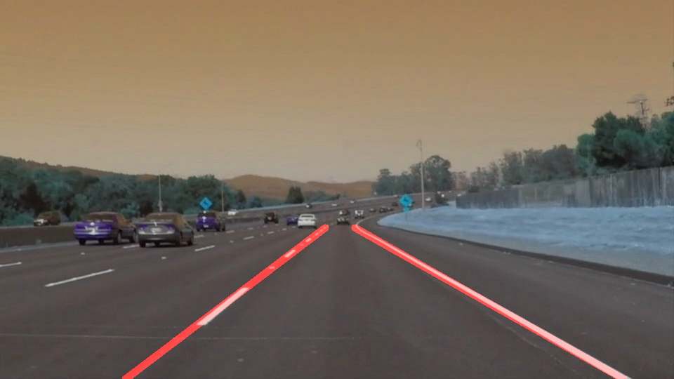

# **Self-Driving Car Nanodegree : Finding Lane Lines on the Road** 

## Writeup Report : Project 1/9

### In this project, I used the tools learned in the lesson to identify lines on the road. I developed a pipeline on a series of invidual images, and later applied the result to a set of video streams. 

---

**Finding Lane Lines on the Road**

The goals / steps of this project are the following:
* Make a pipeline that finds lane lines on the road
* Reflect on the process in a written report (This report)

[//]: # (Image References)

[image1]: ./examples/grayscale.jpg "Grayscale"

---

### Reflection

### 1. Pipeline descriptions and the draw_lines() function.

My pipeline consisted of 5 steps I stated down below.

1) Color Detection : Images are converted to grayscale using openCV library.
2) Blurring : Gray images are blurred using the Gaussian Blur function.
3) Finding edges : Blurred images are then used to detect edges using Canny function, also openCV.
4) Region Masking : A mask is created to define ROI of image using numpy libary. 
5) Using Hough Transform function, Canny images is taken in and return an image with hough lines drawn on it. 

In step 5), in order to draw a single line on the left and right lanes, draw_lines() function is modified.
Modification consists of separating line segments by their slope to decide which segments are part of the
left line vs the right line. This function will draw lines with parametes for color, and thickness. Lines are drawn on the image. 

To better visualize the result, here is an example of an image and its output: 

### 2.  Potential shortcomings with the current pipeline

 Current pipeline might have trouble to perceive the lane lines if the car needs to take a sharp turn
 or even a simple curve maneuver.
 
 Another concern would be the effect of nightlight from night lamps and reflections of headlamps etc
 during nighttime.

### 3.  Possible suggestions for improvements to the pipeline

 A possible improvement would be to also apply small segmentations of the image to acknowledge even the
 sharpest turn or maneuver for the car.
 
 To cater problems that might occur at dark, I suggest that we use value scale in the HSV coordination
 and apply a mask of it in the pipeline.
